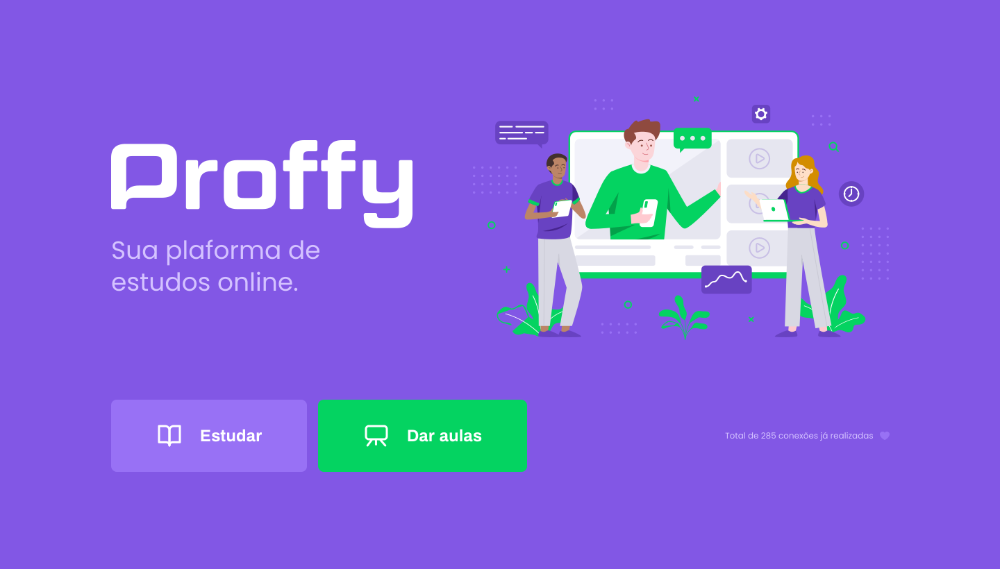

# Next Level Week 08/2020

  

O Projeto Next Level Week  #2 é um projeto realizado pela [Rocketseat](https://rocketseat.com.br/) que visa aprimorar os conhecimentos de desenvolvimento Web dos participantes, ajudando-os a atingir novos níveis de conhecimento técnico. 

O projeto de estudo dessa semana foi a plataforma de estudos Online Proffy. A plataforma  visa conectar alunos aos professores de acordo com a disciplina ofertada pelos professores e horários/dias disponíveis.

<h3 aling="center" >
    ScreenShot da Interface Web 
</h3>

Nesse estudo desenvolvemos tanto a parte do backend quanto a do frontend, o projeto todo está dividido nos seguintes repositórios:

- [Frontend Web Resposivo](https://github.com/luismigsantana/nlw-web)
- [App Mobile](https://github.com/luismigsantana/nlw-mobile)
- [API Rest](https://github.com/luismigsantana/nlw-server)

As tecnologias usadas foram **Node.js** , **React** e **React-Native**. 

## Instalações

Para rodar o projeto em sua maquina é preciso ter as seguintes  ferramentas instaladas:

- Node e NPM
- Yarn 1
- Expo